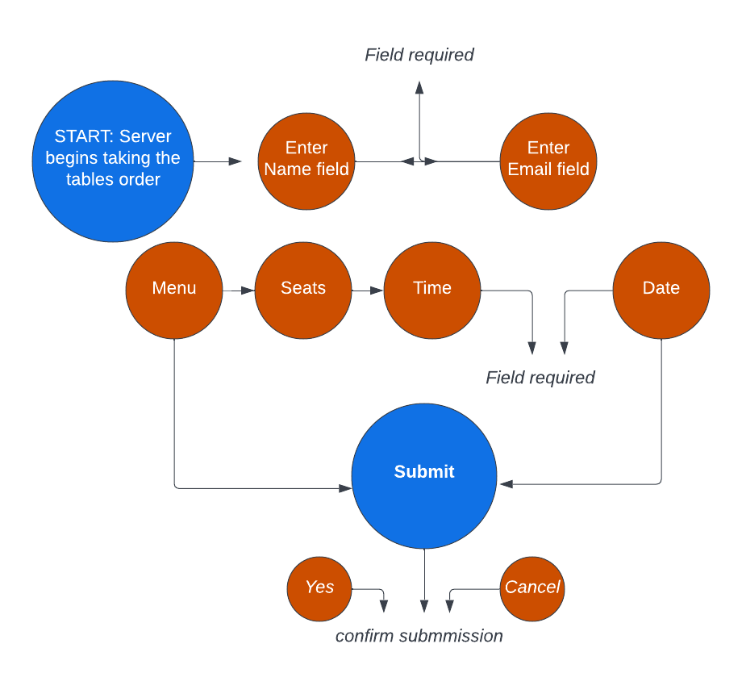
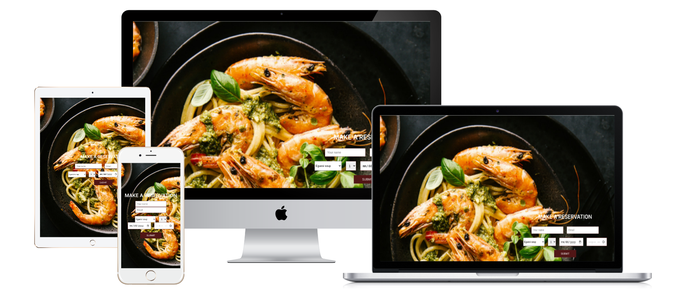
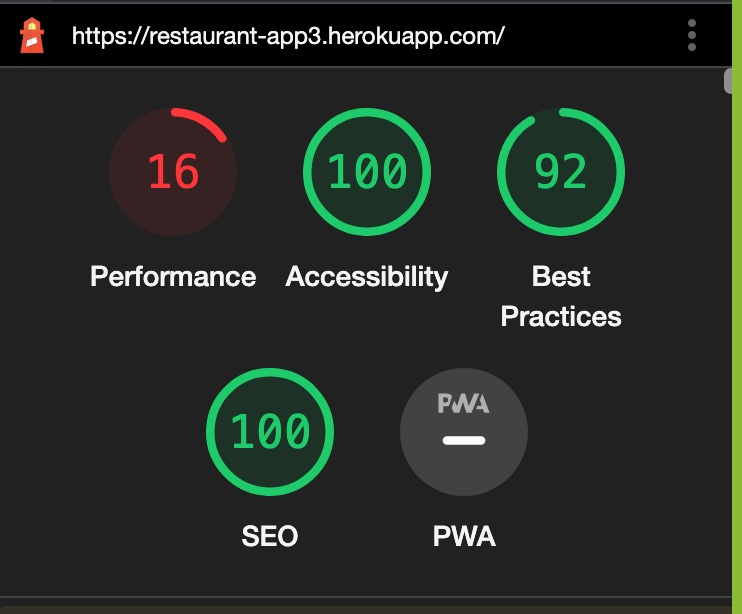

## Introduction
welcome to my bookings/reservation form
the site is a booking system that is friendly for users of all age to use for booking meals

## User stories
* The user is able to nagivate around the form, they are able to manage seats for tables for friends or family, 
* You book mutiple tables 
* User can view list of menu and make a choice from a list of options

## Features

* The form features, Name field, Email field, the menu options, drop of to pick no of seats, time and date

## future features

* create a username and password for login
* user will create an account to be able to login

## FlowChart

## Technology
* Python
* Django
* Javascript
* Html and CSS
* ElephantSQL

 ## Testing
 * `Validation`
 * css validator : No errors was found after checked
 * Html validator: no errors was found

* `Test-cases` (user story based with screenshots)

* `Performance`

 ## Deployment
 1. Log in to Heroku account and go to *Account Settings* 
2. add *API Key* 
3. Copy the key
4. run `heroku_config` in the command line
5. Enter API key

* `ElephantSQL`
1. log in to Elephant account 
2. click on project
3. add database 'URL' value 
4. check activitess feed
5. Open app button to test project
6. add URL to env.py file

* `Heroku`
7. connect to github in `heroku` run `heroku apps` 
8. enable automatic deploy
9. deploy branch

------

## Credit
* Ox-Harris Creative Services
* https://websitemockupgenerator.com/
* W3schools.com
* Stackoverflow.com